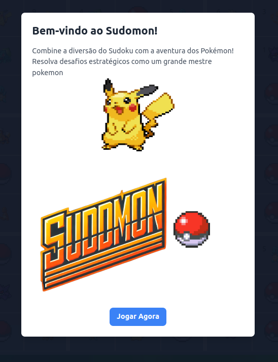
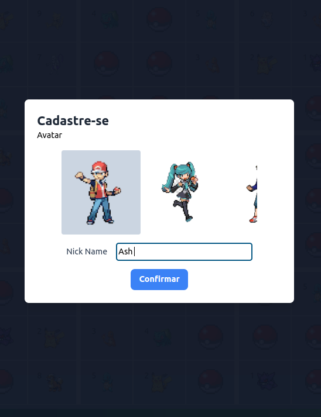
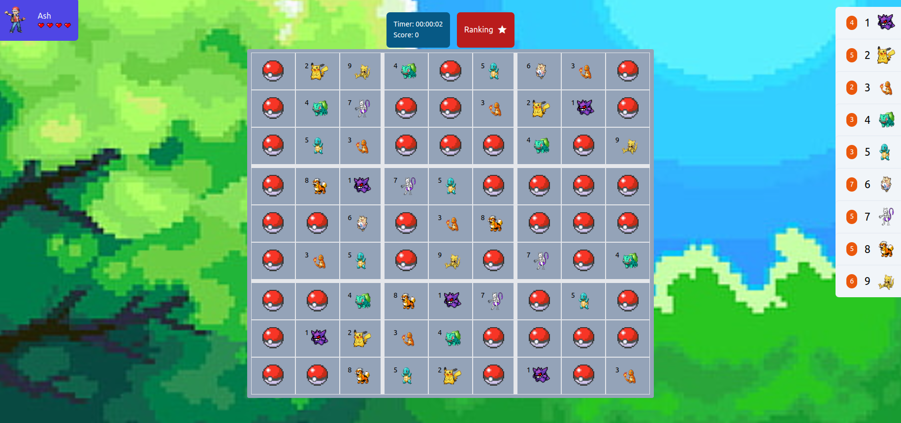
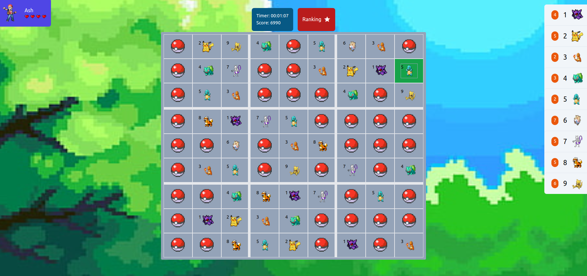
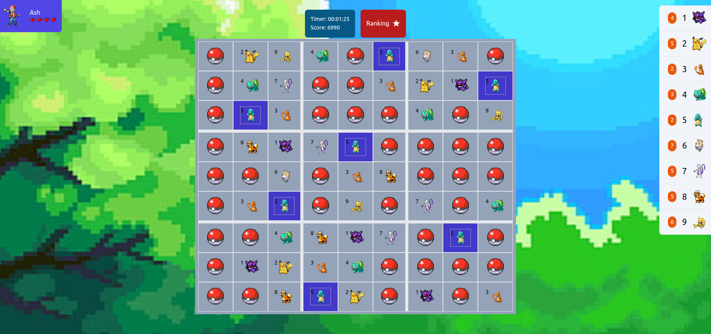

# 🧩 Sudomon

Sudomon é um 🆕 e 🎮 divertido que combina o clássico **Sudoku** 🧠 com o 🔥 e 🧡 design do **Pokémon**. Ele traz uma nova emoção para os fãs de Sudoku e Pokémon ao 🌀 lógica e estratégia com elementos de design 📜.

Este projeto foi criado com tecnologias modernas de 🌐 desenvolvimento:

- **Vue.js**: Para criar uma interface 🔄 e 📡.
- **Tailwind CSS**: Para um 💅🏻 e 📱 responsivo.

---

## ✨ Features

- **🆙 Gameplay Único**: Resolva 🧩 Sudoku com um toque inspirado em Pokémon.
- **UI Dinâmica**: Construído com Vue.js para uma 🎭 e 💻 experiência.
- **🎨 Estilo Lindo**: Tailwind CSS garante um design 📐, 📱 e 📷.
- **⚡️ Níveis Desafiantes**: Vários níveis de 🧑‍🏫 para 👶 e 👩‍🎓.
- **🎭 Elementos Interativos**: Aproveite 📊 e interações que trazem o 🌟 Pokémon à vida.

---

## ⚙️ Instalação

Para rodar Sudomon localmente, siga estes passos:

1. **Clone o Repositório**:
   ```bash
   git clone https://github.com/your-username/sudomon.git
   cd sudomon
   ```

2. **Instale as Dependências**:
   ```bash
   npm install
   ```

3. **Rode o Servidor de Desenvolvimento**:
   ```bash
   npm run dev
   ```
   Abra seu 🌐 navegador e vá para `http://localhost:3000` para jogar Sudomon.

---

## 🛠️ Tecnologias Usadas

- **Vue.js**: Um framework JavaScript 🌀 para 📟.
- **Tailwind CSS**: Um framework CSS utilitário para 🛠️ rápido.
- **JavaScript (ES6+)**: Para 📜 e lógica do 🎮.

---

## 📷 Screenshots

Adicione screenshots ou GIFs aqui para mostrar a interface e o design do 🎮.

---

## 🛣️ Roadmap

- **⚙️ Futuras Features**:
  - 🏆 Leaderboards para 📊 high scores.
  - 💾 Salvar e 📂 progresso do 🎮.
  - 🌈 Temas adicionais e features inspiradas em Pokémon.

---

## 🤝 Contribuindo

Contribuições são 🆗! Siga estes passos:

1. 🪝 o repositório.
2. Crie um 🌿 para sua 💡:
   ```bash
   git checkout -b feature-name
   ```
3. Faça seu 💾:
   ```bash
   git commit -m "Add feature-name"
   ```
4. Envie seu 🌿:
   ```bash
   git push origin feature-name
   ```
5. Abra um 🟰 request.

---

## 📜 License

Este projeto está licenciado sob a [MIT License](LICENSE).


🌟 Divirta-se com a mistura de 🧠 e 🎮 com Sudomon! Pegue todos enquanto resolve 🧩!










